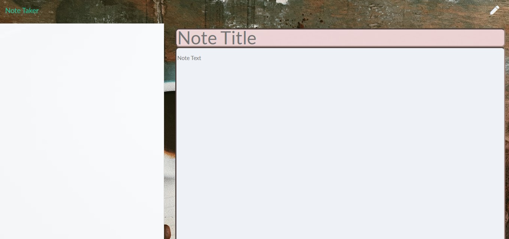
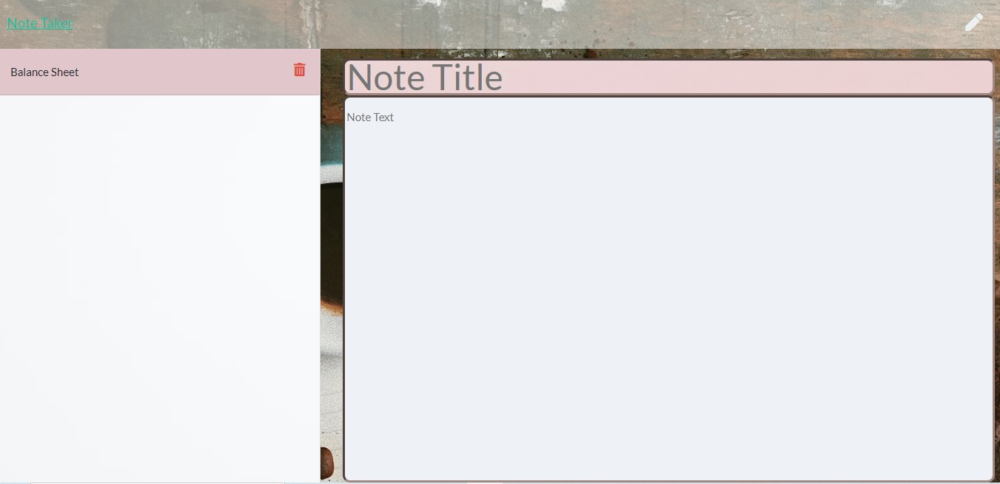

<h1 align="center">Note Taker - Express</h1>

    

    

  

    
    
    
    
     
      
    
    

  
 
## Description
ℹ️ AS A small business owner
## Table of Contents
- [Description](#description)
- [Installation](#installation)
- [Usage](#usage)
- [License](#license)
- [Contributing](#contributing)
- [Tests](#tests)
- [Questions](#questions)
## Installation
💻 I WANT to be able to write and save notes
## Usage
📖run node start.js
## License

 
This application is covered by the MIT license. 
## Screenshots

## Contributing
🙋‍♀️Michelle Hall
## Tests
 No
## Questions
🤔 If people have any questions or want to add to further developments. Please contact via gitHub or email 
 
🖐️ Find me on GitHub: [Chelle77322](https://github.com/Chelle77322) 
 
 Email me with any questions:👉 serenynadarra@gmail.com  
_This README was generated with 🤸‍♀️ by [README-generator](https://github.com/Chelle77322/README-Generator)
    
